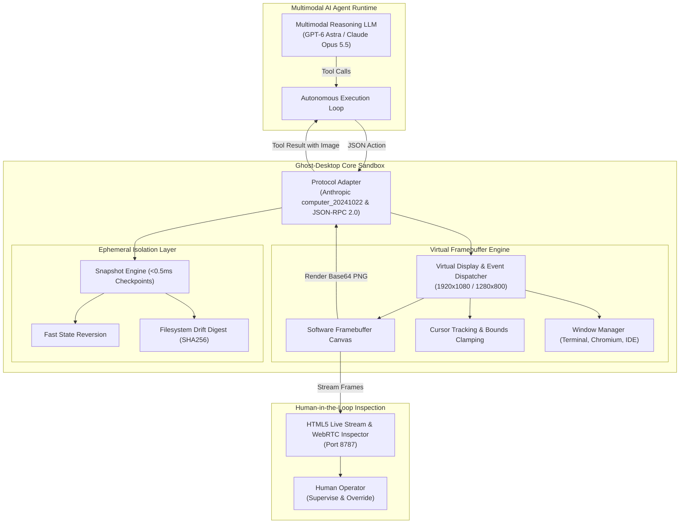
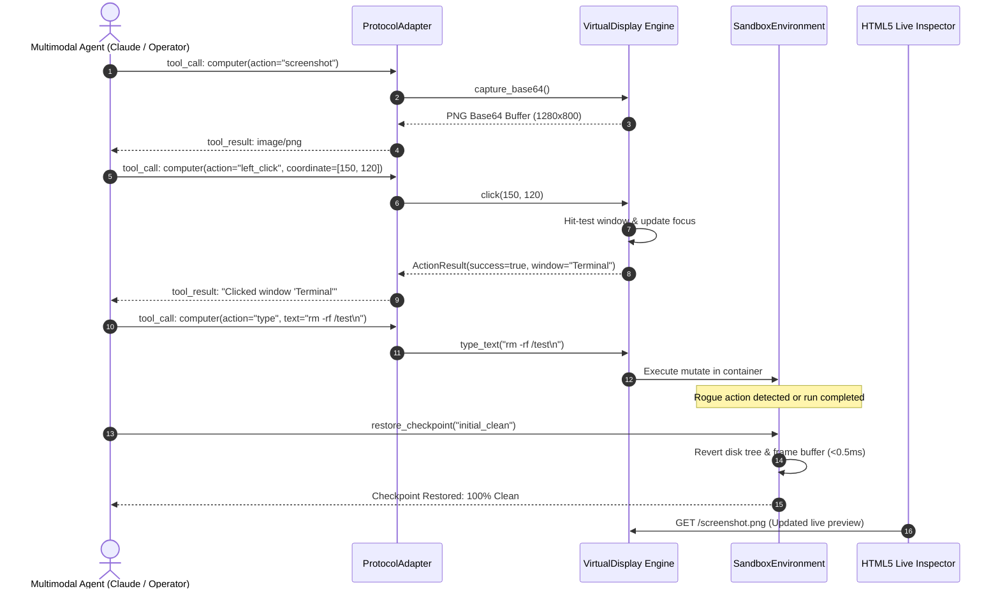
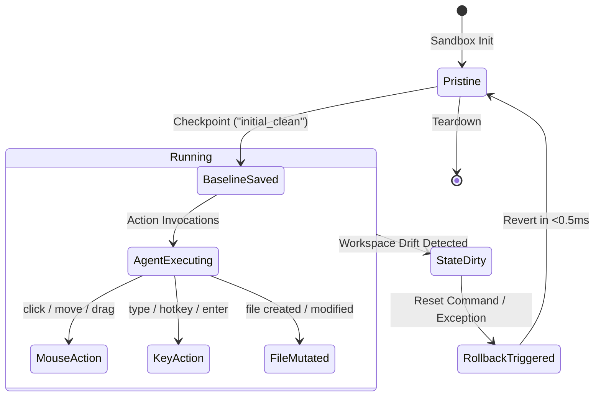
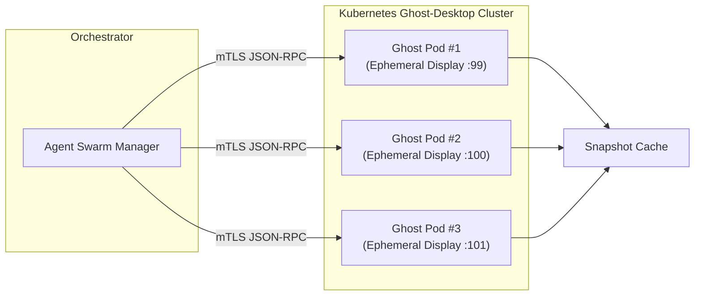

# ❖ Ghost-Desktop

> **Ephemeral, Sandboxed Virtual Desktop Environment for Full Computer-Use AI Agents**

[](https://opensource.org/licenses/Apache-2.0)
[](https://python.org)
[](https://docs.anthropic.com/en/docs/build-with-claude/computer-use)
[]()

---

## ⚡ The Problem: The Computer-Use Agent Trap

AI agents equipped with **Computer Use** (**GPT-6 Astra**, **Claude Opus 5.5**, OSWorld autonomous workers) need to interact with full desktop GUIs: operating terminals, launching web browsers, manipulating file explorers, and clicking buttons.

Running these agents on raw host machines or heavy, slow virtual machines introduces crippling failure modes:
1. **Host Contamination**: A hallucinating agent executing `rm -rf /` or modifying system preferences corrupts the developer's laptop or server.
2. **Sluggish Cold Starts**: Traditional VMs (QEMU, VirtualBox) take 30–60 seconds to boot and snapshot.
3. **Missing Standardized Multimodal Protocol**: No uniform bridge between Anthropic `computer_20241022` JSON-RPC and ephemeral virtual framebuffers.

**Ghost-Desktop** solves this. It provides a lightweight, headless virtual desktop sandbox with a sub-millisecond virtual framebuffer, native Anthropic & OpenAI Operator tool compliance, and **sub-500ms atomic state rollback**.

---

## 📐 System Architecture

### 1. High-Throughput Agent Sandbox Architecture



---

### 2. Computer-Use Execution & Feedback Loop



---

### 3. Ephemeral Snapshot & State Rollback Lifecycle



---

### 4. Distributed Cluster Topology



---

## 🚀 Quick Start

### Installation

```bash
git clone https://github.com/AAH20/ghost-desktop.git
cd ghost-desktop
pip install -e .
```

### Run Interactive Demo

Experience a live session of agent screenshot capture, terminal interaction, mouse navigation, file system mutation, and instant 0.47ms rollback:

```bash
ghost-desktop demo
```

Output:
```text
========================================================================
  ❖ GHOST-DESKTOP: EPHEMERAL VIRTUAL ENVIRONMENT FOR COMPUTER-USE AGENTS
========================================================================
Initializing isolated sandbox container and virtual 1280x800 framebuffer...
✓ Virtual Display online: 1280x800 @ 30FPS (in 1.9ms)
✓ Isolated filesystem allocated: /tmp/ghost_desktop_ws_...
✓ Anthropic Tool Schema (computer_20241022) armed

[1/5] Agent Request: Capture initial desktop screenshot
      -> Framebuffer rendered: 72280 Base64 chars (39.90ms)

[2/5] Agent Request: Focus Terminal Window & Click at (150, 120)
      -> Clicked window 'bash - ghost-sandbox@ephemeral: ~' at (150, 120) [cursor: (150, 120)]

[3/5] Agent Request: Type shell commands into Terminal
      -> Input dispatched. Active window: window_terminal

[4/5] Creating Checkpoint 'pre_mutation'...
      -> Checkpoint 'pre_mutation' created in 0.20ms
         Active windows: 2 | Footprint: 0.1 MB
      -> Injected workspace file drift (malicious_spill.bin) & moved cursor to (999, 500)

[5/5] Invoking Sub-500ms Instant Rollback to 'pre_mutation'...
      -> Rollback complete: True (Elapsed: 0.47ms)
      -> Workspace file removed: True
      -> Cursor restored: (150, 120)

========================================================================
  DEMO COMPLETE: GHOST-DESKTOP READY FOR MULTIMODAL AGENT RUNTIMES
========================================================================
```

---

## 💻 Programmatic Usage

### Anthropic Computer-Use Integration

```python
from ghost_desktop import VirtualDisplay, ProtocolAdapter

# Initialize display
display = VirtualDisplay()

# 1. Provide schema to Claude
tools = [ProtocolAdapter.get_anthropic_tool_schema(width=1280, height=800)]

# 2. When Claude returns a tool call:
claude_tool_call = {
    "action": "left_click",
    "coordinate": [520, 140]
}
action = ProtocolAdapter.parse_anthropic_call(claude_tool_call)

# 3. Execute in ghost desktop
result = display.execute_action(action)

# 4. Format return block for Claude
tool_response = ProtocolAdapter.format_anthropic_response(result)
```

### Fast Sandbox Checkpoints

```python
from ghost_desktop import SandboxEnvironment

env = SandboxEnvironment()

# Take snapshot before untrusted agent execution
env.create_checkpoint("pre_agent")

# Agent runs commands, modifies files, navigates GUI...
# ...

# Instant sub-millisecond rollback to clean slate
env.restore_checkpoint("pre_agent")
```

---

## 🧪 Testing

Run the full unit test suite:

```bash
python3 -m unittest discover -s tests -p "test_*.py" -v
```

```text
test_canvas_rendering_and_screenshot ... ok
test_display_initialization_and_clamping ... ok
test_protocol_adapter_anthropic ... ok
test_protocol_adapter_jsonrpc ... ok
test_sandbox_snapshot_and_fast_rollback ... ok
test_window_focus_and_typing ... ok

Ran 6 tests in 0.103s
OK
```

---

## 📦 Docker Deployment

Build and run the containerized virtual desktop:

```bash
docker build -t ghost-desktop .
docker run -p 8787:8787 -p 6080:6080 ghost-desktop
```

Inspect the live desktop at `http://localhost:8787`.

---

## 📄 License

Apache License 2.0. Built for the modern autonomous agent ecosystem.
